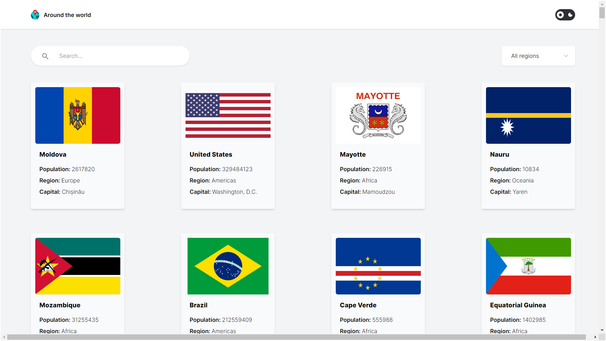
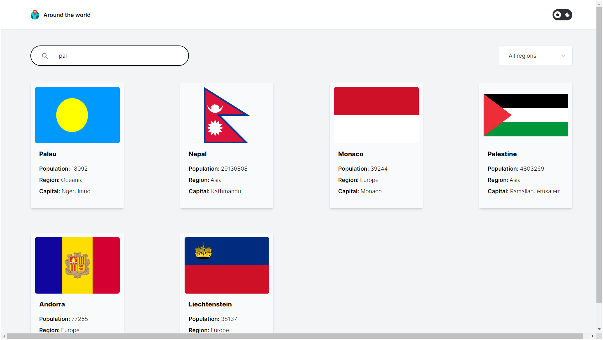
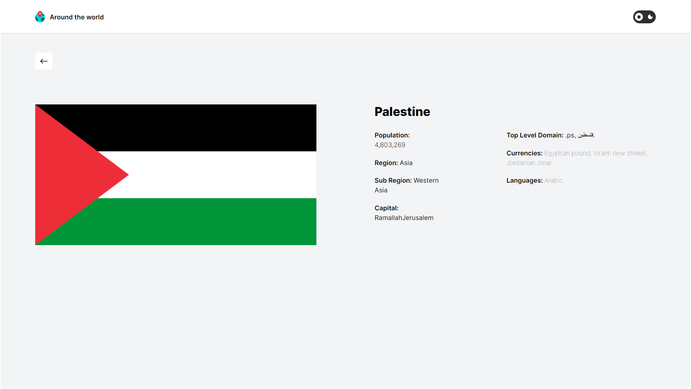
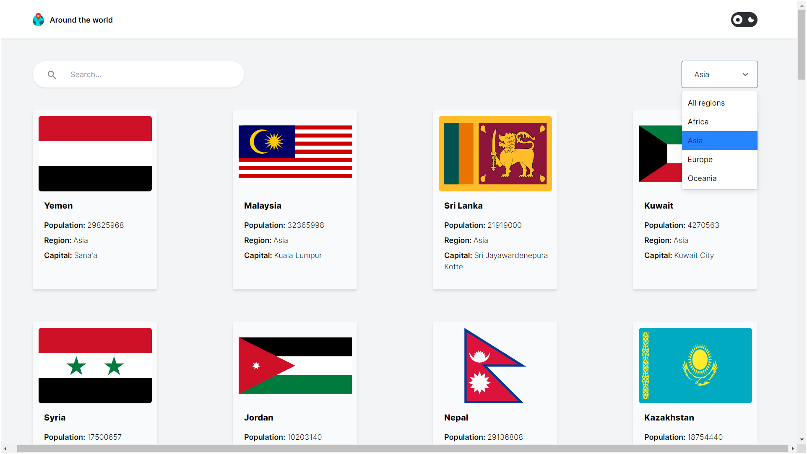
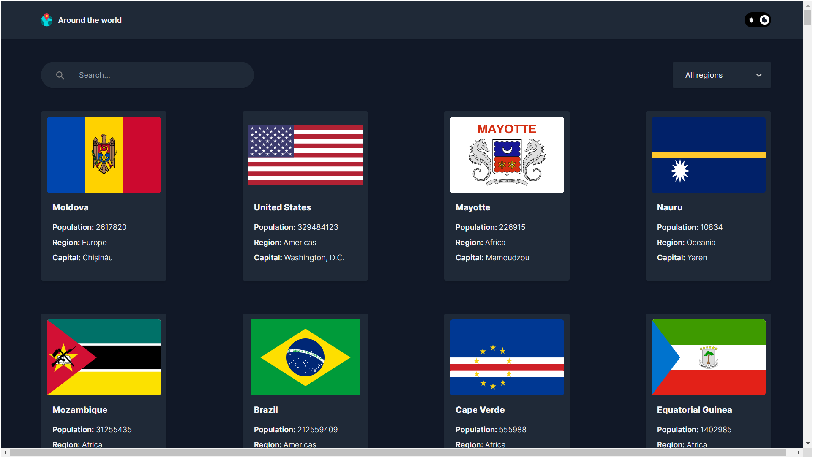

# Around The World 🌎

Around The World is a React project that displays information cards for various countries. The project utilizes an API to fetch data about different countries and presents it in a user-friendly interface. The application is responsive, featuring a region menu to filter countries by continent, a dark theme option, a search bar for easy navigation, and the ability to view detailed information about a country by clicking on its card.

## Screenshots

### Flow Chart 
  

### Home

  
  

### Regions and Countries

  
  

### Dark Mode
  

## Features

- Display cards containing information about different countries.
- Fetch country data from an API.
- Filter countries by continent using the region menu.
- Toggle between light and dark themes.
- Utilize a search bar for easy navigation.
- View detailed information about a country by clicking on its card.

## Technologies Used

- React + Vite
- JavaScript (ES6+)
- Tailwind CSS
- MUI
- RESTful API

## API Used

The project fetches data from the [REST Countries API](https://restcountries.com/), which provides information about countries worldwide.

## Contributing

Contributions are welcome! Feel free to open issues or submit pull requests to suggest improvements or report bugs.

## License

This project is licensed under the MIT License - see the [LICENSE](LICENSE) file for details.

## Contact

- [Author](https://github.com/MohamedHelal0)
- [Website](#)
- [Email](mailto:mhamed.helal3@gmail.com)
- [LinkedIn](https://www.linkedin.com/in/mohamed-helal2002/)
